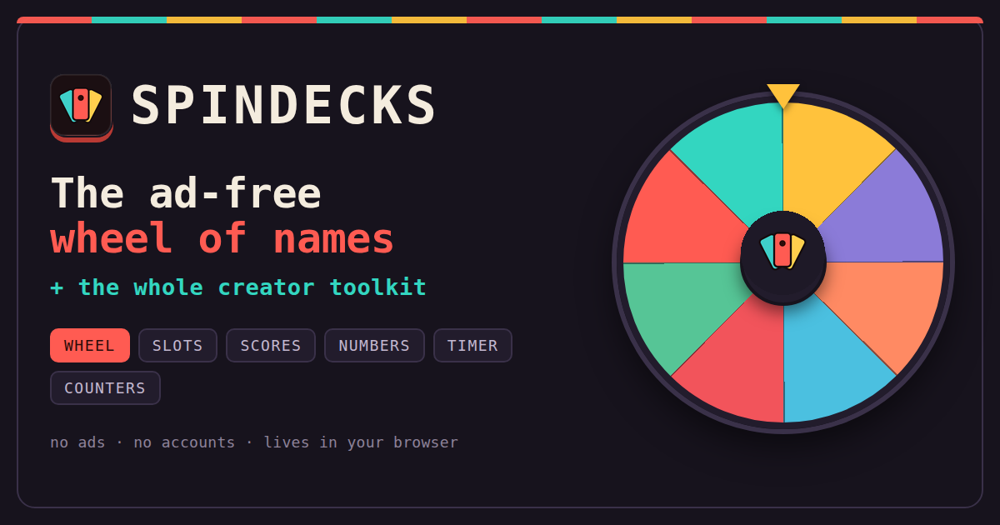

# SpinDeck

### Live: **https://fin6490.github.io/Tools/**

**A faster, ad-free wheel of names — plus the creator toolkit around it.**
Multiple wheels, a timer, and counters, all in one page. No ads, no login, no tracking.
Everything you create lives in *your* browser.



Built as an open, more functional alternative to wheelofnames.com, aimed at the people
who actually lean on these tools every day: **streamers, YouTubers, and teachers.**

---

## Why it exists

The incumbent works, but it's ad-supported, single-purpose, and hasn't evolved much.
A "council" of user archetypes (streamer, teacher, designer, engineer, PM, accessibility,
privacy, and a skeptic keeping scope honest) met to decide what a better version should be.
Their verdict shaped everything below.

The guiding principles they agreed on:

- **No ads, ever.** The site is a zero-backend static app, so it costs almost nothing to run.
 That's what makes an honest "no ads" promise possible. Monetization, *if* it ever comes,
 is an optional Pro tier (cloud sync, branding, teams) — never ads.
- **More than a wheel.** Creators juggle a wheel *and* a timer *and* a tally counter.
 SpinDeck puts all three in one tab.
- **Your data is yours.** No accounts, no servers, no analytics. Everything is in
 `localStorage`, with one-click export/import and shareable links.

---

## Features (v1)

### The wheel
- Smooth 60fps canvas spin with real easing and a satisfying tick + winner fanfare.
- **Multiple named wheels** — build "Period 1", "Subscribers", "Games to play" once,
 switch between them in a click. All saved automatically.
- **Weighted entries** — `Alice*3` makes Alice three times as likely. Duplicates get their own slice.
- **Per-entry custom colours** — add a hex code to any line (`Bob #ff5a5f`, or `Cara *2 #0af` with a weight). Label text auto-picks black or white for contrast; entries without a colour keep the harmonious auto palette.
- **Per-slice images** — the Images button opens an image manager; upload a picture for any name and it renders (circular-cropped) on that slice. Images are downscaled and stored locally.
- **Remove winner after spin** — perfect for classroom cold-calls and elimination giveaways.
- Editor tools: shuffle, sort, de-duplicate, live entry/slice count.
- **Winner history** with timestamps, per wheel.
- **Elimination mode** — each spin knocks out the pick; keep spinning until one name is left and it's crowned Champion. Perfect for tournaments and "last one standing" bits.
- **Reel style** — flip the picker to a horizontal "Wheel of Fortune" strip that spins sideways. It uses a rectangle instead of a circle, so it fits far more names comfortably. Per-wheel setting.
- Auto-assigned harmonious colors.

### Slot reels
- A **row of vertical reels** side by side that spin together, slot-machine style.
- Choose how many reels (2–6) and point each one at any of your saved wheels — spin one list many times, or mix different lists (names + challenges + numbers) into a combo.
- Staggered stops, a gold payline, and a result under each reel.
- **Spin all** at once, or **spin one reel at a time** (click a reel, or its Spin button).
- A **Results** log records each spin (the combo from Spin all, or a single reel), with timestamps and a clear button.

### Team / group maker
- Split any list of names into **random, balanced teams** — sizes differ by at most one.
- Two modes: **by number of teams** or **by team size**.
- One-click **Load current wheel** to reuse names you already typed (weights are stripped).
- Editable team names, **re-roll** for a fresh shuffle, and **copy** the result as text.
- **To wheels** turns each team into its own saved wheel in one click — great for "spin within the winning team."
- The classroom/stream staple the original wheel handles poorly.

### Scoreboard
Several modes for any number of players:
- **Freeplay** — a generic running score: editable value, **± buttons** with a custom step, **quick +1 / +5 / +10** chips, live ranking, highlighted leader. Good for board games and card nights.
- **Race to target** — set a target (presets incl. **121 / Cribbage**); first player to reach it wins.
- **Golf (low)** — same scoring, but the **lowest** score leads/wins.
- **Rounds** — set a number of rounds; step through them, and when they're done the **highest total wins**.
- **Darts (X01)** — a proper darts counter: pick **301 / 501 / 701** (or custom), optional **double-out**, then enter each turn total (0–180) to count down to zero. Handles **bust** (over-throw and, with double-out, leaving 1) reverting the turn, shows **3-dart average** and darts thrown, ranks by remaining, auto-advances turns, crowns the **leg winner**, with **Undo** and **New leg**.
- **Cricket** — the standard darts board (20–15 + Bull). Tap a number to add a mark (three closes it); closed numbers score their value against anyone who hasn't closed them. Live points, win detection (all closed + ahead), and **Undo**.

### Random numbers
- Pick a **range** (min/max) and **how many** to draw; **no repeats** for lottery-style draws.
- One-tap presets: **Dice (1–6)**, **D20**, **Coin flip** (Heads/Tails), **1–100**, **Lottery (6 of 49)**.
- Shows sum + mean for multi-draws, and a copy button.

### Timer
- **Countdown** (with quick presets + custom time) and **stopwatch** modes.
- Drift-free (timestamp-based), giant readable clock, optional end beep.
- Great for speedrun segments, "you have 5 minutes" challenges, and buzzer rounds.

### Counters
- Unlimited named tally counters — spins, slot pulls, score, deaths, anything.
- Custom step size, reset, and a counter named "Spins" auto-increments when you spin the wheel.

### Everywhere
- **Presentation mode** (`F`) — hides all the editing chrome for a clean on-stream look.
- Dark / light themes, adjustable spin length, mute, confetti toggle.
- **Keyboard**: `Space` spins, `F` presents, `Esc` closes.
- **Import / export** all your data as JSON, and **copy a share link** for any single wheel.
- Accessible: screen-reader winner announcements, `prefers-reduced-motion` respected, keyboard-first.

---

## Run it

It's a pure static site — no build step, no dependencies.

```bash
# any static server works, e.g.
npx http-server -p 8123
# then open http://localhost:8123
```

Or just open `index.html` over a local server (ES modules need `http://`, not `file://`).

### Deploy free
Push to any static host — **GitHub Pages, Netlify, Vercel, Cloudflare Pages**. No config needed.

---

## Project layout

```
index.html # markup + layout
css/styles.css # theme tokens, layout, components (light + dark)
js/app.js # orchestrator: wires UI storage tools
js/wheel.js # canvas wheel: parsing, drawing, weighted spin, easing
js/storage.js # localStorage state, import/export, share encoding
js/timer.js # countdown + stopwatch
js/counter.js # tally counters
js/scores.js # multiplayer scoreboard
js/slots.js # multiple slot reels
js/numbers.js # random number generator
js/groups.js # random balanced team maker
js/images.js # per-slice image manager (upload + downscale)
js/sound.js # WebAudio tick / fanfare / beep (no audio files shipped)
js/confetti.js # canvas confetti burst
```

---

## Roadmap (parked by the council for later)

| Next up (cheap, likely soon) | Pro / v2 |
| --- | --- |
| Save/name custom palettes | Cloud sync & accounts |
| Open Graph preview image (share previews) | Team wheels / collaboration |
| Greenscreen / overlay export for OBS | Custom branding & themes |
| Twitch/YouTube chat auto-populate entries | Native mobile app |

---

## Privacy

No accounts. No servers. No tracking or analytics. Your wheels, counters, and settings
never leave your browser. Clear them any time from the ⋯ menu *Reset everything*.
